# 🛒 E-Commerce API

Production-style Spring Boot backend powering a full-stack e-commerce platform.

This project demonstrates secure REST API development, role-based access control, realistic commerce workflows, Flyway database migrations, payment simulation, inventory handling, observability foundations, CI verification, build metadata, and GitHub-based bug reporting.


---

## 🚀 Live Project

| Resource | Link |
|---|---|
| Backend API | https://ecommerce-api-xrkk.onrender.com |
| Swagger UI | https://ecommerce-api-xrkk.onrender.com/swagger-ui/index.html |
| Frontend Demo | https://mikeywestie.github.io/ecommerce-admin-ui/ |
| Frontend Repository | https://github.com/mikeywestie/ecommerce-admin-ui |

---

## 🧰 Tech Stack


---

## 📦 Current Release

| Component | Version |
|---|---|
| Backend API | `v1.7.2` |
| Frontend UI | `v1.2.1` |

### v1.7.2 Highlights

- Build metadata endpoint for deployed version, commit hash, branch, and build time
- GitHub issue integration for in-app bug reporting
- Payment simulation fixes for successful and failed checkout scenarios
- Inventory reservation moved to successful payment flow
- Customer order security improvements
- Customer users can only access their own order history
- Improved demo readiness for admin and customer workflows

---

## 🎯 Project Purpose

This repository is designed to demonstrate practical backend engineering beyond basic CRUD.

It shows how a commerce API can be built with:

- Clean Spring Boot layering
- Secure authentication and authorization
- Customer and admin role separation
- Realistic order, payment, coupon, cart, and inventory workflows
- Database versioning with Flyway
- Production-style health checks
- Build metadata visibility
- CI verification and automated tests
- GitHub issue creation from in-app bug reports
- Docker-based local infrastructure
- A clear roadmap toward event-driven microservices

---

## 📚 API Documentation

The API is documented with OpenAPI 3 and Swagger UI.

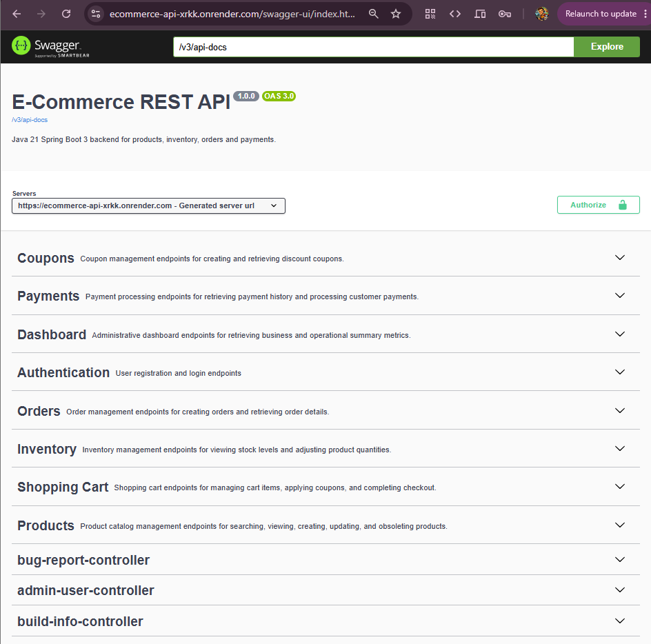

### Controller Screenshots

| Area | Screenshot |
|---|---|
| Authentication | 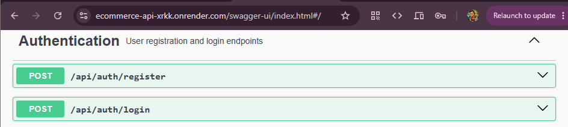 |
| Products | 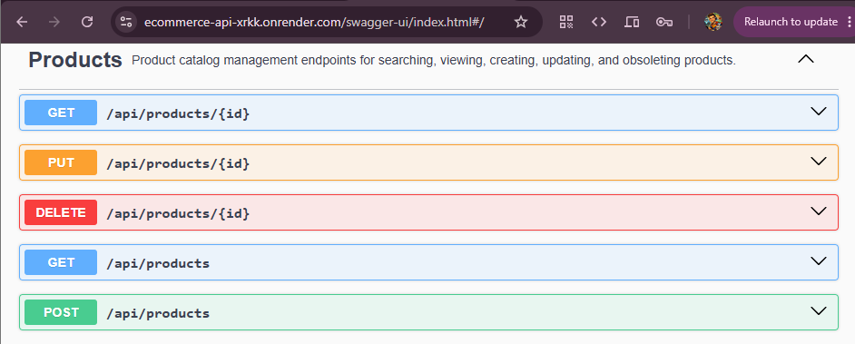 |
| Inventory | 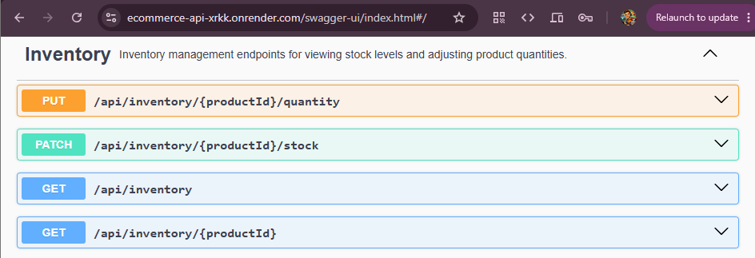 |
| Cart | 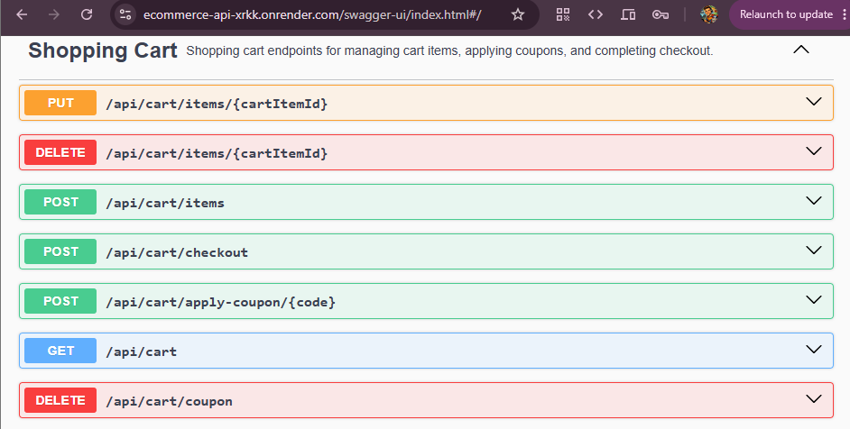 |
| Orders | 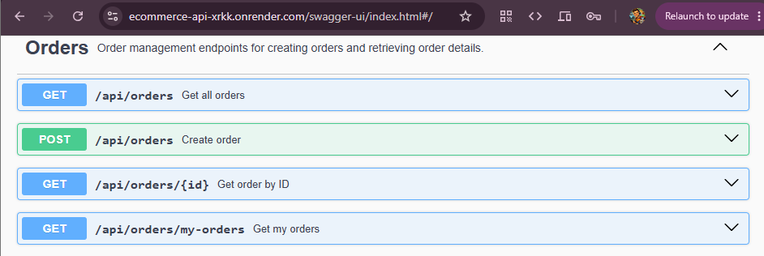 |
| Payments | 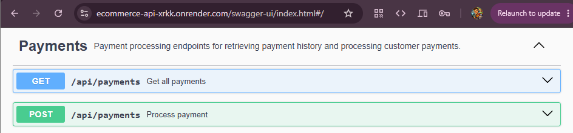 |
| Coupons | 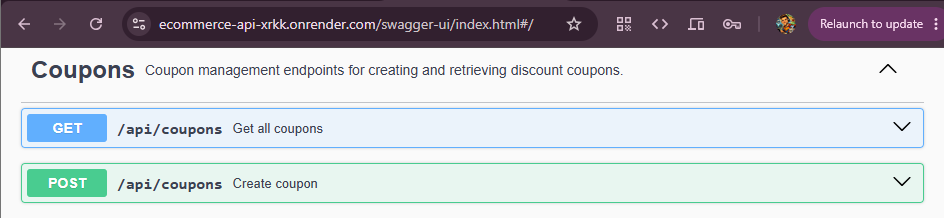 |
| Dashboard | 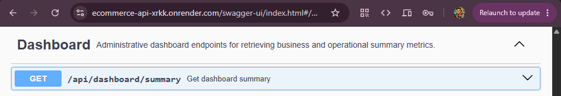 |
| Bug Reporting | 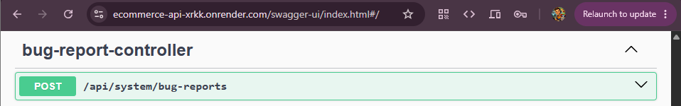 |
| Admin User Management | 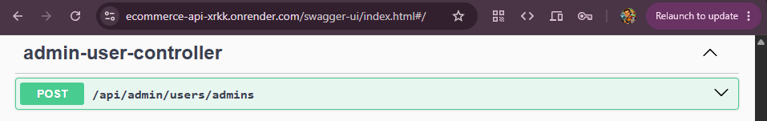 |
| Build Information | 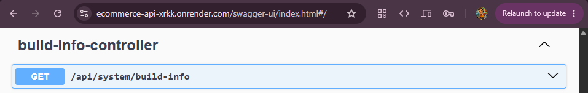 |

---

## 🔐 Authentication and Authorization

The backend uses JWT-based stateless authentication with Spring Security.

| Role | Purpose |
|---|---|
| `ADMIN` | Manage products, inventory, orders, payments, coupons, dashboard data, and system health |
| `CUSTOMER` | Browse products, manage cart, checkout, view own order history, and report bugs |

Security capabilities include:

- JWT authentication
- BCrypt password hashing
- Role-based endpoint protection
- Admin-only operational endpoints
- Customer-specific order history
- Secure API access from the React frontend

---

## 🧩 Core Domain Features

### Product Catalog

- Product listing
- Category and subcategory support
- Brand support
- Product image URL support
- Active/inactive product status
- Demo product catalog seeded through Flyway

### Inventory Management

- Inventory per product
- Stock quantity updates
- Low-stock visibility in the UI
- Optimistic locking support
- Inventory reservation occurs only after successful payment

Business rule:

```text
Order created      -> stock remains unchanged
Payment successful -> stock decreases
Payment failed     -> stock remains unchanged
Refund/cancel      -> stock restoration planned
```

### Cart and Checkout

- Customer cart
- Add/remove/update cart items
- Coupon application
- Checkout from cart
- Payment success simulation
- Payment failure simulation

### Orders

- Admin can view all orders
- Customer can view only their own orders
- Orders include line items and totals
- Order statuses include:

```text
CREATED
PAID
PAYMENT_FAILED
CANCELLED
```

### Payments

- Payment simulation
- Successful payment marks order as `PAID`
- Failed payment marks order as `PAYMENT_FAILED`
- Payment records are stored separately
- Inventory is reserved only on successful payment

### Coupons

Supported coupon rules include:

| Code | Type | Rule |
|---|---|---|
| `SAVE10` | Percentage | Permanent demo coupon |
| `WELCOME250` | Fixed amount | Permanent demo coupon |
| `FIRSTBUY` | Fixed amount | Single-use first purchase coupon |
| `VIP5` | Percentage | Reusable customer loyalty coupon |

---

## 🔨 Build Metadata

The backend exposes build information so the deployed version can be verified from the UI.

Endpoint:

```http
GET /api/system/build-info
```

Example response:

```json
{
  "application": "ecommerce-api",
  "version": "1.7.2",
  "environment": "render",
  "branch": "main",
  "commit": "7b0f8ca...",
  "commitShort": "7b0f8ca",
  "buildTime": "2026-06-13T16:45:59Z"
}
```

This makes it easy to verify exactly which backend build is currently deployed.

---

## 🐞 In-App GitHub Bug Reporting

The frontend can submit bug reports directly to the backend.

The backend then creates a GitHub issue in the frontend repository using a secure token stored in Render environment variables.

Bug reports include:

- User message
- Steps to reproduce
- Current route
- User role
- User email
- Frontend version and commit
- Backend version and commit
- Browser details
- Viewport size
- Screenshot capture support

Endpoint:

```http
POST /api/system/bug-reports
```

### Bug Report Dialog

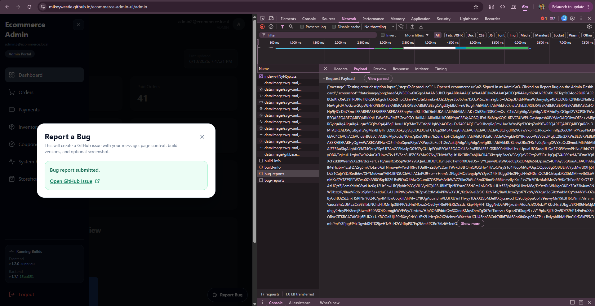

### Generated GitHub Issue


---

## 🏗 Architecture

```text
React Admin / Customer UI
        │
        ▼
Spring Boot REST API
        │
 ┌──────┼──────────────┬──────────────┐
 ▼      ▼              ▼              ▼
JWT   PostgreSQL     Flyway         GitHub Issues
        │
        ▼
Domain Services
        │
 ┌──────┼──────────────┬──────────────┐
 ▼      ▼              ▼              ▼
Orders Payments     Inventory       Coupons
        │
        ▼
Kafka Domain Events
        │
        ▼
Actuator / Metrics
        │
        ▼
Prometheus / Grafana Support
```

For a deeper explanation, see [`docs/ARCHITECTURE.md`](docs/ARCHITECTURE.md).

---

## 🐳 Local Infrastructure

The local environment is containerized with Docker Compose.

Typical services:

- Spring Boot API
- PostgreSQL
- Apache Kafka
- Zookeeper
- Prometheus
- Grafana


---

## ❤️ Health and Observability

Spring Boot Actuator exposes health and operational endpoints.

Available health endpoints:

```http
GET /actuator/health
GET /actuator/health/liveness
GET /actuator/health/readiness
```

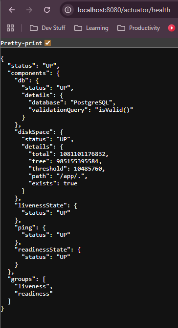

The platform also includes support for:

- Spring Boot Actuator
- Prometheus metrics export
- Grafana dashboards
- Health, readiness, and liveness probes

Prometheus and Grafana are configured through Docker Compose and are available for future operational monitoring and alerting enhancements.

---

## 🧪 Testing and Quality

The project includes automated testing for service, controller, authentication, and security behavior.

### Test Coverage Areas

- Cart service
- Coupon rules
- Order creation
- Payment processing
- Product controller
- Authentication controller
- Authentication service
- JWT service
- Security rules
- Testcontainers smoke test

Run tests locally:

```bash
mvn clean verify
```

Coverage report:

```text
target/site/jacoco/index.html
```

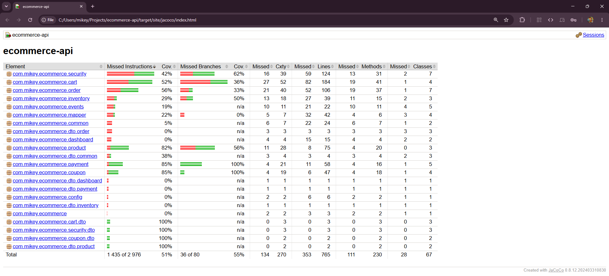

---

## 🔐 Security Rules

| Endpoint Area | Access |
|---|---|
| `/api/auth/**` | Public |
| `GET /api/products/**` | Public |
| `/api/cart/**` | Customer |
| `GET /api/orders/my-orders` | Customer/Admin |
| `GET /api/orders` | Admin |
| `/api/inventory/**` | Admin |
| `/api/coupons/**` | Admin |
| `/api/dashboard/**` | Admin |
| `/api/payments/**` | Admin |
| `/api/system/bug-reports` | Authenticated customer/admin |
| `/actuator/health/**` | Public |
| `/actuator/prometheus` | Admin |

---

## 🔧 Environment Variables

### Render / Production

```env
PORT=8080

DB_HOST=
DB_PORT=
DB_NAME=
DB_USERNAME=
DB_PASSWORD=

GITHUB_BUG_REPORT_TOKEN=
GITHUB_BUG_REPORT_REPO=mikeywestie/ecommerce-admin-ui

RENDER_GIT_COMMIT=
RENDER_GIT_BRANCH=

KAFKA_BOOTSTRAP_SERVERS=
```

### CORS

Current allowed origins include:

```text
http://localhost:5173
http://localhost:5174
https://mikeywestie.github.io
```

---

## 🧪 API Usage Examples

### Login

```http
POST /api/auth/login
Content-Type: application/json
```

```json
{
  "email": "admin2@ecommerce.local",
  "password": "Admin@12345"
}
```

### Get Products

```http
GET /api/products
```

### Get Customer Cart

```http
GET /api/cart
Authorization: Bearer <jwt-token>
```

### Checkout With Successful Payment

```http
POST /api/cart/checkout?paymentOutcome=SUCCESS
Authorization: Bearer <jwt-token>
```

### Checkout With Failed Payment

```http
POST /api/cart/checkout?paymentOutcome=PAYMENT_FAILED
Authorization: Bearer <jwt-token>
```

### Submit Bug Report

```http
POST /api/system/bug-reports
Authorization: Bearer <jwt-token>
Content-Type: application/json
```

```json
{
  "message": "Payment failed but order history shows paid.",
  "stepsToReproduce": "1. Add product to cart\n2. Checkout\n3. Simulate payment failed",
  "route": "/customer/checkout",
  "userEmail": "customer@example.com",
  "userRole": "CUSTOMER",
  "frontendVersion": "1.2.1",
  "frontendCommit": "abc1234",
  "backendVersion": "1.7.2",
  "backendCommit": "def5678",
  "browser": "Chrome",
  "viewport": "390x844"
}
```

---

## 🗂 Release Milestones

### v1.0 Core REST API

- Product catalog
- Inventory management
- Orders
- Payment simulation
- PostgreSQL persistence
- Swagger/OpenAPI documentation

### v1.1 API Hardening

- DTO refactor
- Bean validation
- Pagination, sorting, and filtering
- ProblemDetail-style errors

### v1.2 Database Quality

- Flyway migrations
- Auditing fields
- Optimistic locking
- Repeatable schema evolution

### v1.3 Security

- JWT authentication
- Stateless Spring Security
- BCrypt password hashing
- Role-based authorization

### v1.4 Commerce Features

- Shopping cart
- Checkout flow
- Coupon engine
- Fixed and percentage discounts
- Kafka domain events

Published events:

```text
order-created
payment-processed
coupon-applied
```

### v1.5 DevOps Foundation

- Docker Compose stack
- Multi-stage Docker builds
- GitHub Actions CI foundation
- Spring Boot Actuator
- Testcontainers foundation

### v1.6 Observability

- Prometheus metrics endpoint
- Grafana dashboard support
- JVM metrics
- HTTP metrics
- Database connection metrics
- Kafka metrics foundation

### v1.7 Quality, Security, and Demo Readiness

- Expanded automated tests
- Customer-specific order history
- Improved role-based access control
- Build metadata endpoint
- Payment simulation fixes
- Inventory reservation aligned to successful payment
- GitHub issue-based bug reporting
- More realistic seeded demo data

---

## 🧠 Engineering Challenges Solved

| Challenge | Solution |
|---|---|
| Preventing entity leakage | DTO-based API contracts |
| Securing protected resources | JWT authentication and role-based authorization |
| Handling customer/admin separation | Role-aware endpoints and route security |
| Managing schema changes | Flyway migrations |
| Avoiding incorrect stock changes | Inventory reserved only after successful payment |
| Supporting failed payment demos | Explicit payment simulation outcomes |
| Improving production visibility | Build metadata endpoint and actuator health |
| Making bugs easier to report | GitHub issue creation from app bug reports |
| Improving reliability | CI verification and automated tests |
| Supporting future microservices | Modular domain boundaries and Kafka event foundation |

---

## 🛣 Roadmap

### v1.8 Demo Operations

- Cancel/refund backend endpoint
- Restore inventory on refund
- Admin bug report visibility
- Screenshot attachment or external screenshot storage
- MASTER/admin tooling for demo reset

### v2.0 Event-Driven Microservices

Planned service decomposition:

- Product Service
- Order Service
- Payment Service
- Inventory Service
- Coupon Service

Planned messaging patterns:

- Saga pattern
- Transactional outbox
- Idempotent consumers
- Dead letter queues

Planned platform components:

- API Gateway
- Service discovery
- Distributed configuration
- Distributed tracing

Planned cloud-native additions:

- Kubernetes
- Helm charts
- GitOps deployment
- Cloud observability

---

## 🖼 Screenshot Files Included

```text
docs/images/01-architecture-overview.png
docs/images/02-swagger-overview.png
docs/images/03-authentication-endpoints.png
docs/images/04-products-endpoints.png
docs/images/05-inventory-endpoints.png
docs/images/06-cart-endpoints.png
docs/images/07-orders-endpoints.png
docs/images/08-payments-endpoints.png
docs/images/09-coupons-endpoints.png
docs/images/10-dashboard-endpoints.png
docs/images/11-bug-report-endpoint.png
docs/images/12-admin-user-endpoint.png
docs/images/13-build-info-endpoint.png
docs/images/14-actuator-health.png
docs/images/15-docker-environment.png
docs/images/16-jacoco-coverage.png
docs/images/17-bug-report-dialog.png
docs/images/18-github-issue-created.png
```

---

## 💼 Portfolio Value

This backend demonstrates the kind of engineering work expected in real business systems:

- Secure APIs
- Clear domain boundaries
- Database migration discipline
- Testing and CI
- Operational health visibility
- Build/version traceability
- Realistic commerce workflows
- Production-style debugging support
- A practical path toward event-driven microservices

It is intentionally built to be discussed in interviews, reviewed by technical leads, and paired with the React frontend as a complete full-stack portfolio system.

---

## 👨‍💻 Author

**Michael Westman**

Full Stack Software Engineer

- Java
- Spring Boot
- PostgreSQL
- Kafka
- React
- TypeScript
- Docker
- Cloud-ready application development

GitHub: https://github.com/mikeywestie

Portfolio: https://mikeywestie.github.io
