# 🛒 E-Commerce RESTful API

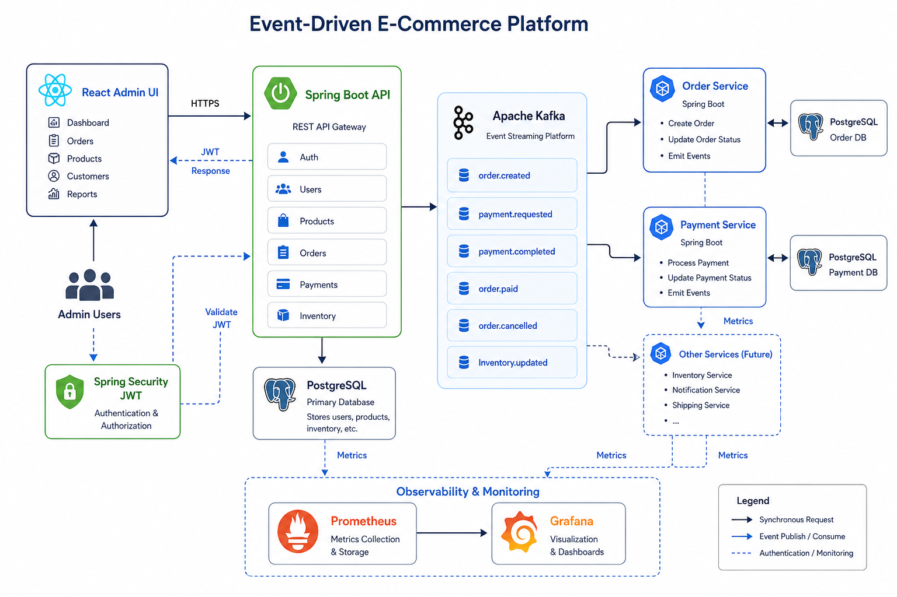


## 📚 API Documentation

The platform exposes a fully documented REST API using OpenAPI 3 and Swagger UI. The screenshots below showcase the available endpoints across the different business domains.

### Swagger UI Overview
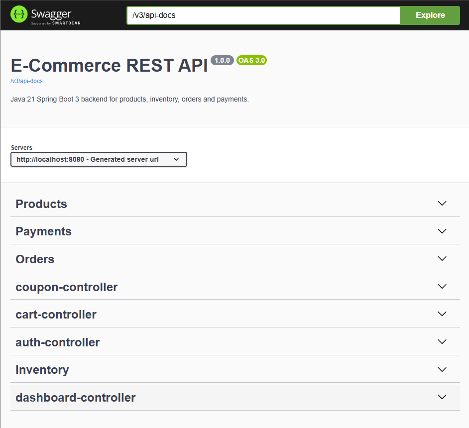

### Products Controller
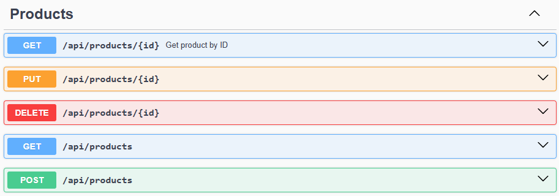

### Payments Controller
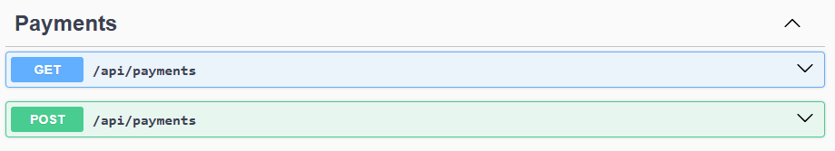

### Orders Controller
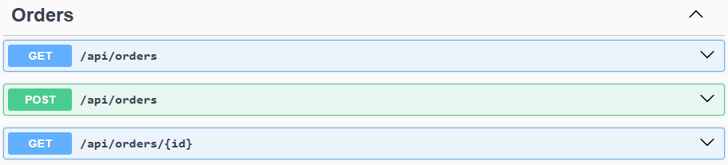

### Coupon Controller
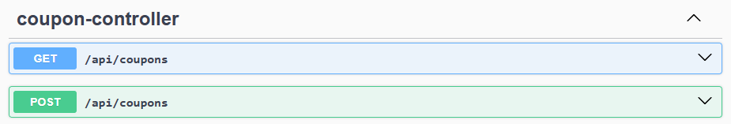

### Cart Controller
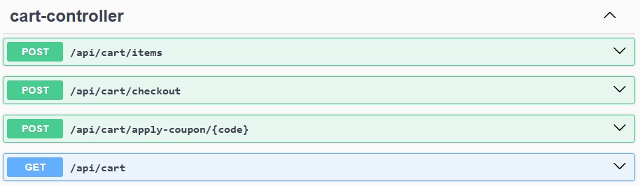

### Authentication Controller
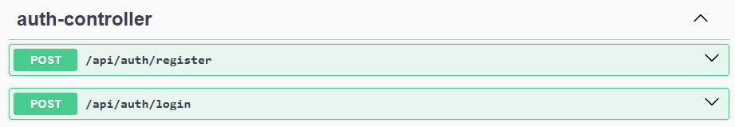

### Inventory Controller
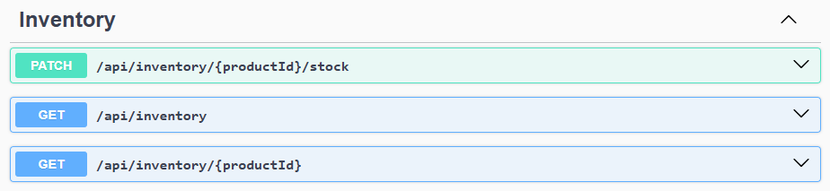

### Dashboard Controller
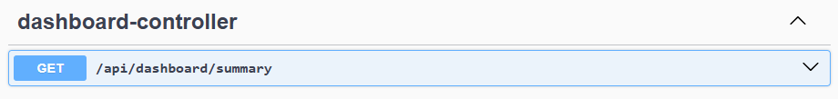

---

## 🐳 Containerized Infrastructure

The entire development environment is orchestrated with Docker Compose, including PostgreSQL, Apache Kafka, Prometheus, and Grafana.

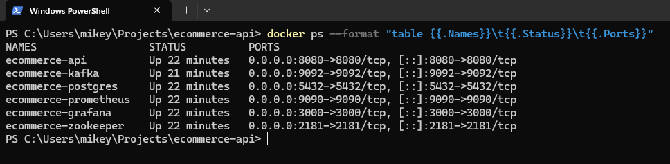

---

## ❤️ Application Health

Spring Boot Actuator provides health, liveness, and readiness endpoints to ensure the application and all dependencies are operating correctly.


Production-style backend e-commerce platform built to showcase secure API development, event-driven architecture, observability, and DevOps practices. The platform models realistic commerce workflows and is complemented by a React-based admin dashboard. Based on the README you shared and updated to reflect your current progress, including Prometheus and Grafana integration. :contentReference[oaicite:0]{index=0}

---

## 🎯 Project Purpose

This project demonstrates practical software engineering capabilities including:

- Designing layered architectures
- Building secure REST APIs
- Implementing JWT authentication and role-based access control
- Applying optimistic locking and concurrency protection
- Publishing domain events with Apache Kafka
- Containerizing applications with Docker
- Exposing health and metrics endpoints
- Visualizing operational metrics with Prometheus and Grafana
- Automating builds with GitHub Actions
- Writing production-quality documentation

Frontend Admin Dashboard:

➡️ **Ecommerce Admin UI**  
https://github.com/mikeywestie/ecommerce-admin-ui

---

## 🚀 Current Release

**Latest Stable Release:** `v1.6.0 Observability Complete ✅`

**Next Major Release:** `v2.0 Event-Driven Microservices 🚀`

---

## 🗂️ Release Milestones

Each milestone reflects an intentional architectural progression, prioritizing correctness, maintainability, and production readiness.

### Architectural Trade-Offs and Decisions

- **Modular Monolith First** — Simplified development and debugging while preserving a clear migration path to microservices.
- **REST APIs Before Kafka Workflows** — Stabilized business logic before introducing asynchronous communication.
- **DTO Mapping Over Entity Exposure** — Protected API contracts from persistence model changes.
- **Optimistic Locking** — Improved throughput while protecting inventory updates.
- **Docker Compose** — Created a reproducible development environment.
- **Metrics Before Dashboards** — Exposed Prometheus metrics before adding Grafana dashboards.
- **Incremental Testing Strategy** — Established a Testcontainers foundation before expanding test coverage.

---

### v1.0 Core REST API ✅

Implemented foundational commerce capabilities.

**Features**
- Product Catalog
- Inventory Management
- Orders
- Payment Simulation
- PostgreSQL Persistence
- Swagger/OpenAPI Documentation

**Why this milestone matters**  
Established the core domain model and API structure.

---

### v1.1 API Hardening ✅

Improved API usability and resilience.

**Features**
- DTO Refactor
- Validation
- Pagination, Sorting, Filtering
- ProblemDetail Exception Handling

**Why this milestone matters**  
Separated API contracts from entities and standardized errors.

---

### v1.2 Database Quality ✅

Added production-quality data practices.

**Features**
- Flyway Migrations
- Auditing (`created_at`, `updated_at`)
- Optimistic Locking
- Concurrency Protection
- Integration Tests

**Why this milestone matters**  
Ensures repeatable schema evolution and data integrity.

---

### v1.3 Security ✅

Secured the API.

**Features**
- JWT Authentication
- Stateless Spring Security
- BCrypt Password Hashing
- Role-Based Authorization

**Roles**
- ADMIN
- CUSTOMER

**Why this milestone matters**  
Demonstrates modern API security patterns.

---

### v1.4 Commerce Features ✅

Implemented realistic commerce workflows.

**Features**
- Shopping Cart
- Cart Checkout Flow
- Coupon Engine
- Fixed and Percentage Discounts
- Kafka Domain Events

**Published Events**
- `order-created`
- `payment-processed`
- `coupon-applied`

**Why this milestone matters**  
Introduced event-driven architecture and richer business logic.

---

### v1.5 DevOps Foundation ✅

Operationalized the platform.

**Features**
- Docker Compose Stack
- Multi-stage Docker Builds
- GitHub Actions CI/CD Foundation
- Spring Boot Actuator
- Testcontainers Foundation

**Why this milestone matters**  
Introduced deployment automation and operational tooling.

---

### v1.6 Observability Complete ✅

Added production-style monitoring.

**Features**
- Prometheus Metrics Endpoint
- Prometheus Scraping
- Grafana Dashboards
- JVM Metrics
- HTTP Metrics
- Database Connection Metrics
- Kafka Consumer Metrics

**Why this milestone matters**  
Provides real-time visibility into system health and performance.

---

## 🛣️ Roadmap

### v2.0 Event-Driven Microservices 🚀

#### Service Decomposition
- Product Service
- Order Service
- Payment Service
- Inventory Service

#### Messaging Patterns
- Saga Pattern
- Transactional Outbox
- Idempotent Consumers
- Dead Letter Queues

#### Platform Components
- API Gateway
- Service Discovery
- Distributed Configuration
- Distributed Tracing

#### Cloud Native
- Kubernetes
- Helm Charts
- GitOps
- Cloud Deployment

---

## 🏗️ Architecture

```text
Controller
   ↓
Service
   ↓
Repository
   ↓
PostgreSQL

             Kafka Domain Events
                    ↓
                Prometheus
                    ↓
                 Grafana